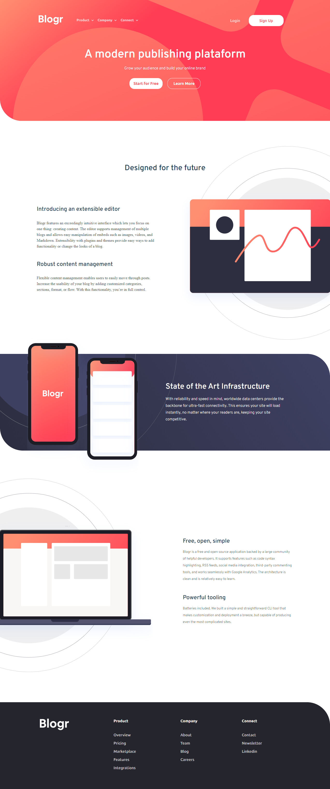
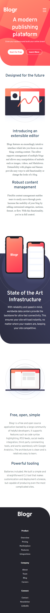

# Frontend Mentor - Blogr landing page solution

This is a solution to the [Blogr landing page challenge on Frontend Mentor](https://www.frontendmentor.io/challenges/blogr-landing-page-EX2RLAApP). Frontend Mentor challenges help you improve your coding skills by building realistic projects. 

## Table of contents

- [Overview](#overview)
  - [The challenge](#the-challenge)
  - [Screenshot](#screenshot)
- [My process](#my-process)
  - [Built with](#built-with)
  - [Continued development](#continued-development)
- [Author](#author)

**Note: Delete this note and update the table of contents based on what sections you keep.**

## Overview

### The challenge

Users should be able to:

- View the optimal layout for the site depending on their device's screen size
- See hover states for all interactive elements on the page

### Links

- [Github Pages](https://jefferson00.github.io/BlogrLandingPage/src/)

### Screenshot

## My process

### Built with

- Semantic HTML5 markup
- CSS custom properties
- Flexbox

### Continued development

this is just the first challenge that i did from [Frontend Mentor](https://www.frontendmentor.io/challenges)

i'll go forward to the next level!

## Author

- Linkedin - [Jefferson](https://www.linkedin.com/in/jefferson-c-silva-aa1b7b1a9/)
- Frontend Mentor - [@jefferson00](https://www.frontendmentor.io/profile/Jefferson00)

